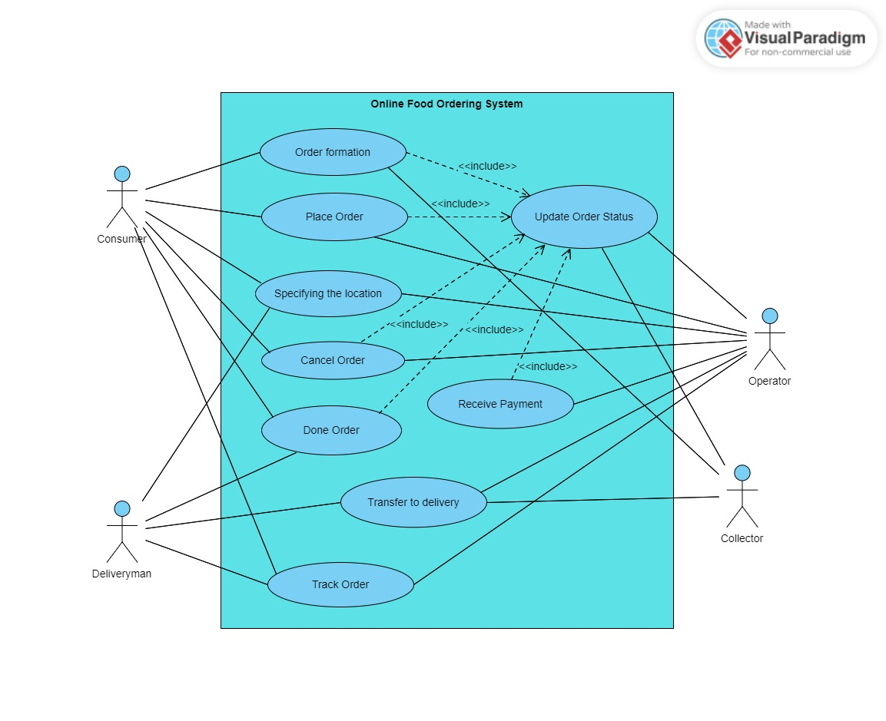
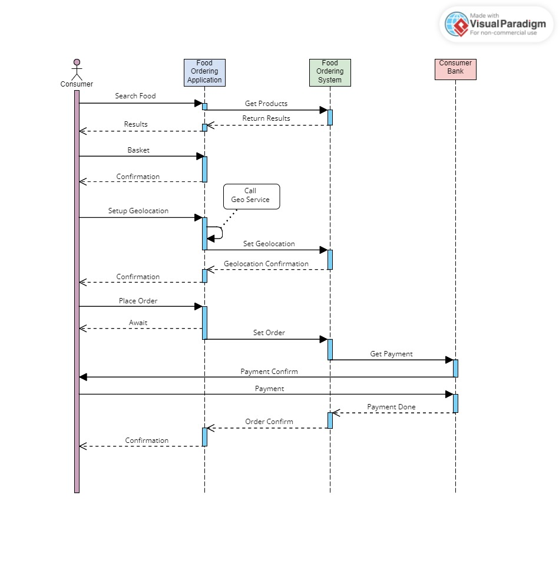
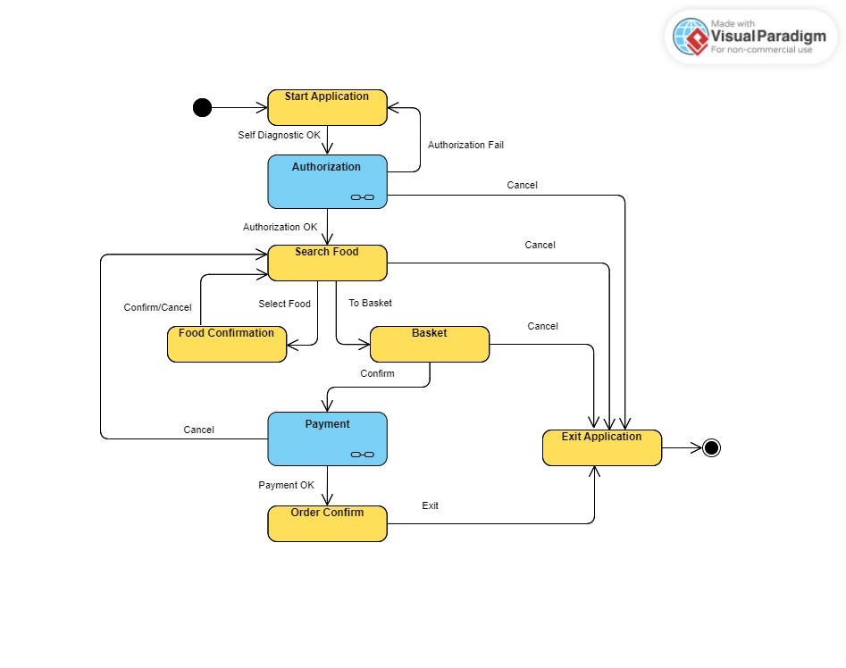
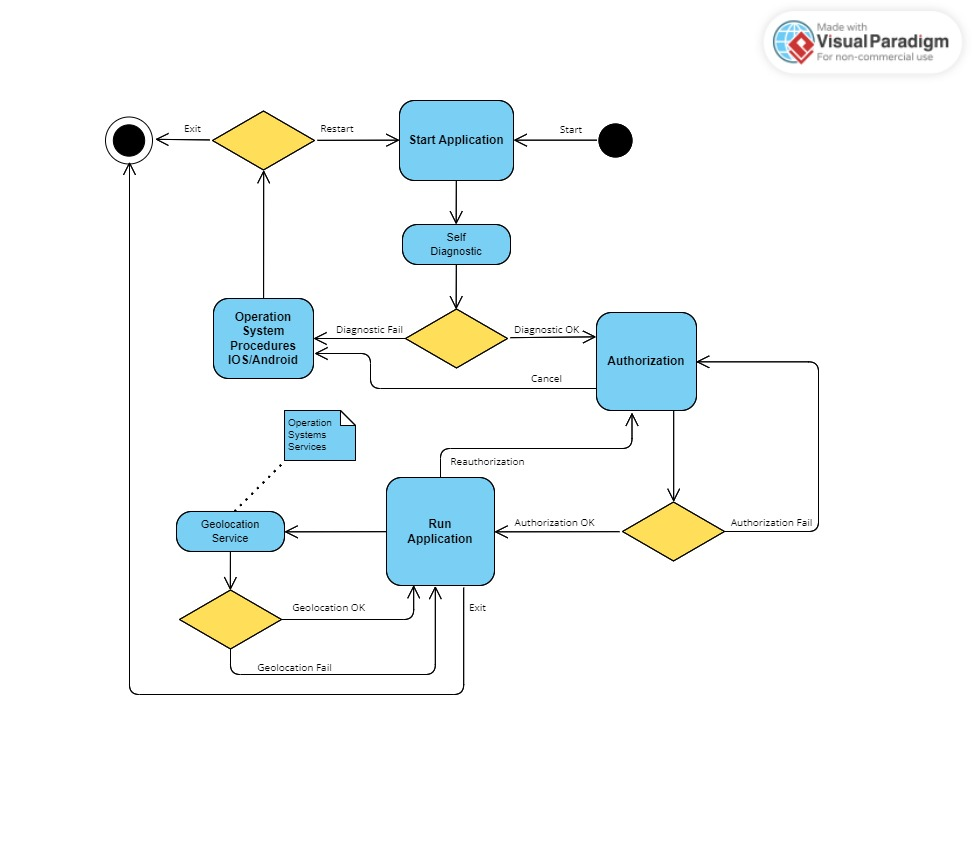
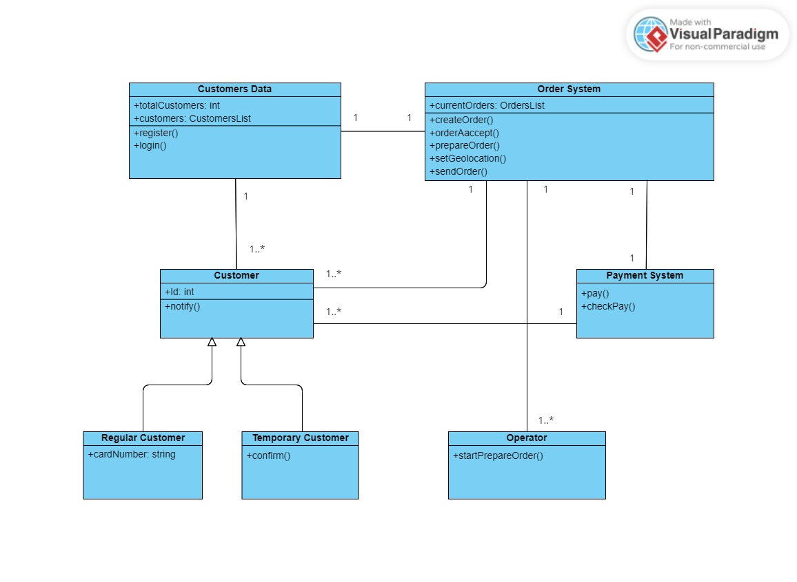

# Проектирование небольшого приложения по требованиям ТЗ№3 (ВШЭ)

В данной работе описывается онлайн-система заказа еды через мобильное приложение. Предложены некоторые процессы и сценарии, которые являются логичны и реализуемы, с точки зрения пректировщика. В рамках проектирования этой системы подготовлены пять UML-диаграмм. Названия и термины в этих диаграммах приведены на английском языке.

## Диаграмма вариантов использования (Use Case Diagram)

- На данной диаграмме внутри границ проектируемой системы можно увидеть различные варианты ее использования такие как "Формироване Заказа", "Обновление Статуса Заказа" и другие. Акторы, обозначенные на диаграмме за пределами системы, показывают сценарии использования этих вариантов. На данной диаграмме указаны самые основные варианты использования и акторы системы.
## Диаграмма последовательности (Sequence Diagram)

- На данной диаграмме показана последовательность операций при заказе еды через мобильное приложение. Пользователь начинает работать в приложении с поиска еды. Затем следуют шаги подтверждения "корзины", установка своей геолокации, подтверждение заказа и оплата. В этой последовательности, кроме пользователя, участвует само мобильное приложение, онлайн система заказа еды и банк пользователя.
## Диаграмма состояний (State Machine Diagram)

- На данной диаграмме показаны состояния приложения во время использования. Два сложных состояния, которые содержат в себе субсостояния, нарисованы голубым цветом. Для этих состояний требуется создавать отдельные диаграммы.
## Диаграмма деятельности (Activity Diagram)

- На данной диаграмме показана активность приложения на основных этапах работы. Присутствуют этапы диагностики при старте, авторизации, различных ошибок. Показан возможный переход управления к операционной системе и вызовы сервисов операционной системы.
## Диаграмма классов (Class Diagram)

- На данной диаграмме показана организация взаимодействия основных классов и модулей системы. Базовым модулем является класс Order System, который обеспечивает все основные операции системы. Customer Data является вспомогательным модулем который хранит данные всех пользователей. Regular Customer и Temporary Customer это наследники родительского класса Customer. Так же описан класс Operator который наряду с классом Customer интенсивно взаимодействует с модулем Order System. Payment System так же является вспомогательным классом.
